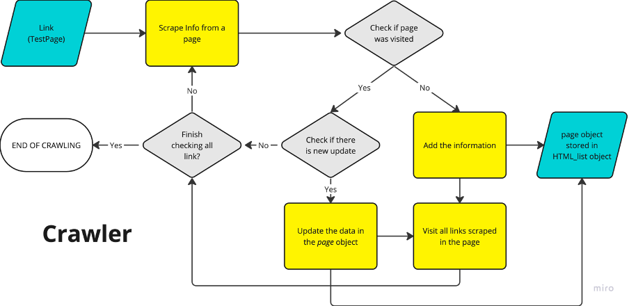
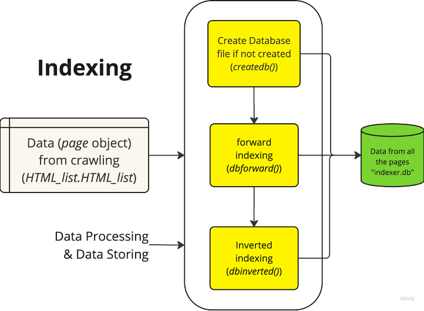
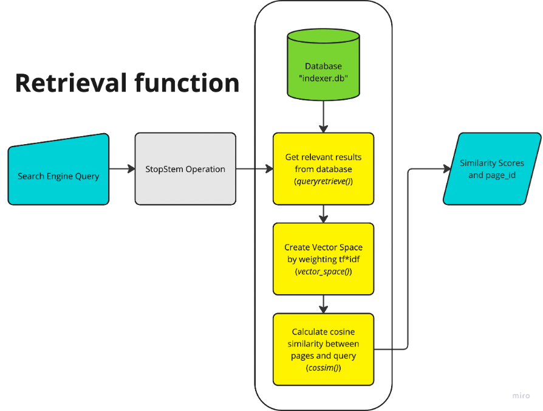

# PythonSearchEngine -  Basic Python Search Engine

This program is developed by Group 15 of COMP4321.
This readme serves as a brief introduction and simple instruction to the set up of our search engine.

---

## Dependencies

Before running the program, we will need to run the commands below in the python terminal to ensure libraries are properly installed. 

```bash
    python.exe -m pip install --upgrade pip
    pip install flask
    pip install requests
    pip install bs4
    pip install nltk
    pip install python-dateutil
    pip install numpy
    pip install lxml
```

---

## Running the program

1. Before running the program, please ensure this program folder is directly opened in your IDE. I.e., the origin of the relative path directory should be exactly this program file.
2. After installing necessary libraries, run Python main.py on your IDE terminal to execute the program. 
3. Check the python terminal, there will be a statement `* Running on http://_________`, open the link on your browser to start the search engine.
4. Input the query you wish to search and click search.

---

## Content highlight

1. **`main.py`** - Handle web interface and all the process initiation (e.g. crawling, indexing, etc) 
2. **`scraper.py`** - Source code for handling the 'back-end' processes. Including information managament at database, calculation, data handling, etc.
3. **`templates`** (folder) - Responsible for the handling the web interface
4. **`schema.md`** - Describes the relational database structure that is responsible for storing the search engine data.
5. **`stopwords.txt`** - A text file containing stopwords for stopword removal during the indexing. 
6. **`indexer.db`** (not included) - Only created when upon initiation of crawler. You may also have a predefined indexer.db store into the program. 
7. **`query_log.txt`** (not included) - Queries record from your device.
8. **`readmeimages`** (folder) -  Images for `readme.md`
9. **`readme.md`** - It is in markdown format for better illustration.

---

## Data Flow of the search engine

The search engine will undergo four stages at certain time of usage. Crawling the webpages, indexing content from the pages, retriving information based on users' queries, and staging web interface for user experience. The graphs below will better illustrate the data flow of it. 




---

As three non computer science students developing this, we hope you have a pleasant experience using our program. 
And please give us a better grading :joy:
